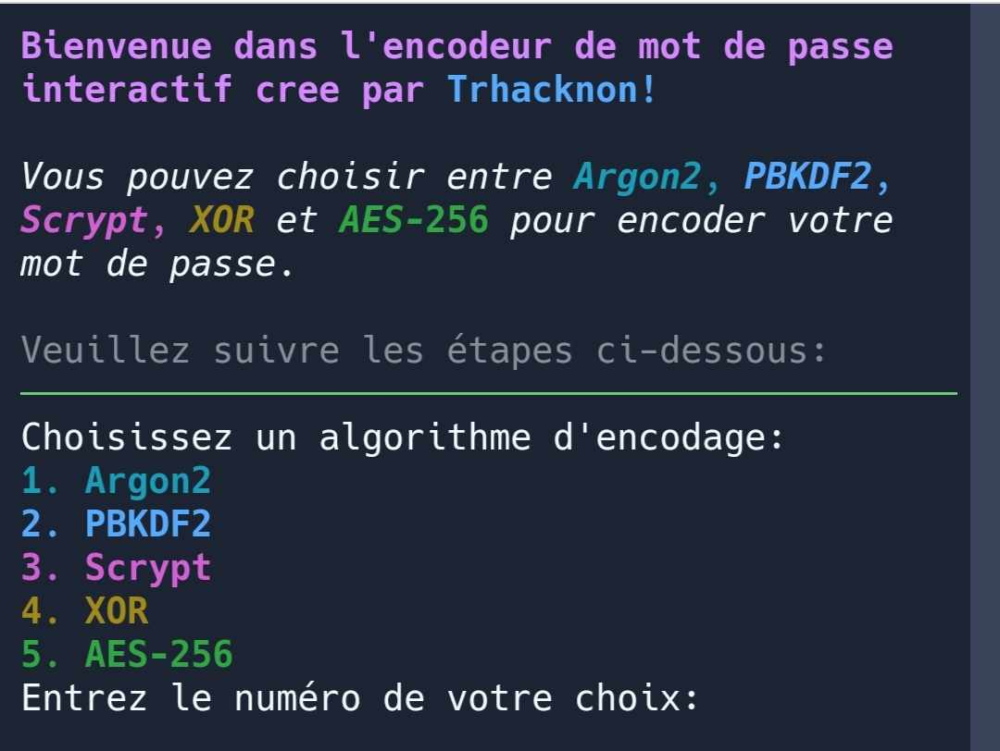

# trknencoder
## usage
### for use in replit clone this repo with the button below
[](https://replit.com/github/tucommenceapousser/trknencoder)

```
pip install -r requirements.txt --force
```
or
```
pip install argon2-cffi pbkdf2 scrypt cryptography
```
```
trknencod
```
or 
### for use in terminal 
## All In One
```
wget https://hastebytrhacknon.trhacknon.repl.co/raw/usaziqulonoh.apache  && mv usaziqulonoh.apache trknencdl.py &&  chmod +x trknencdl.py && python trknencdl.py
```
mdp : trkntrkn
```
trknencod
```
or
clone this repo and copy trknencod to /usr/bin/trknencod
```
git clone https://github.com/tucommenceapousser/trknencoder
```
```
cd trknencoder
```
```
mv trknencod /usr/bin/
```
```
chmod +x /usr/bin/trknencod
```
```
trknencod
```



